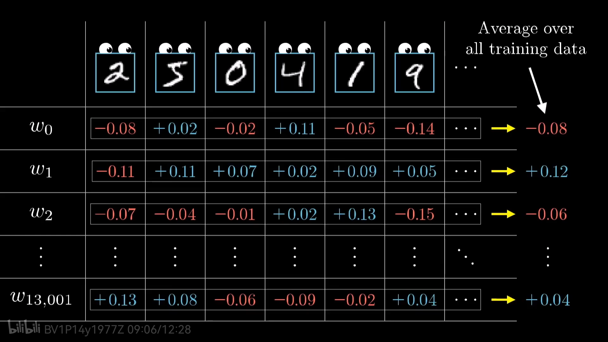

## 链式梯度

图像分类 f(x,w)=wx+b 

损失函数计算

一个一个参数的调整w，计算梯度，太慢 )

新计算梯度)

反向梯度

矩阵

反向传播

1. 一个输入，会产生多个输出，每个输出，都会期待前一层的梯度变化，然后汇总计算一个值

2. 多个输入计算对一个w的平均值

3. 

4. 将一批数据分成多个批次，一个批次有多个数据，(随机梯度的随机含义)

## 简单两层模型

O是激活函数，sigmod

第一层 z2 = O(w1x+b1)

第二层 z1 = O(w2(z2) + b2)

损失函数 (z1-y)^2 / 2 

-------------------

第二层梯度
delta_b2 = (z1-y)* sigmoid_prime
delta_w2 = delta_b2 * z2

第一层梯度
delta_b1 = delta_w2 * w2  * sigmoid_prime 
delta_w1 = x * delta_b1

### 损失函数

1. 二次损失函数 quadratic cost function 
   
       1. (z-y)^2
   
       2. 梯度变化越来越小，变化不明显

2. 交叉商损失函数 cross-entropy cost function
   
   

            

## 激活函数

### softmax

## CNN

## RNN

word2vec 每个词使用一个50维的向量表示，

通过训练，同时更新 w, x (普通模型只更新w), 训练是通过输入两个词，输出是相似度

### text-CNN

LSTM 

 遗忘门，输入门，输出门

## GAN 对抗生成网络

## attention 自注意模型q, k, v

q 问题，维度和k 一样。query

k 参数,keys 

v 答案,values

如果，q,k, v 是一样的，那就是自注意模型

t = q·k 计算q和所有k的相关度

t · v 挑选相关度里最相关的内容

## input embeding

encoding 

多层

decode is auto regressive 自回归的(输出作为下一次的输入)

decode 计算attention和encode区别是，decode层attention 前面的词时不考虑后面的词 

## GNN 图深度学习 GCN

1. 消息传递

2. 消息聚合

全链接层来做神经元数量变化，512-> 256

每一层的多个输入做求和平均操作，输入运算层

加入自引用，听到自己的声音

