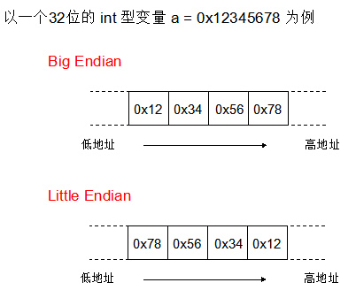

大端，小端

在计算机内部，小端序被广泛应用于现代性 CPU 内部存储数据；而在其他场景譬如网络传输和文件存储使用大端序。
使用小端序时不移动字节就能改变 number 占内存的大小而不需内存地址起始位。比如我想把四字节的 int32 类型的整型转变为八字节的 int64 整型，只需在小端序末端加零即可
网络协议层操作二进制数字时约定使用大端序，大端序是网络字节传输采用的方式。因为大端序最高有效字节排在首位（低地址端存放高位字节），能够按照字典排序，所以我们能够比较二进制编码后数字的每个字节。

固定长度编码
  BigEndian  
  LittleEndian 

变长 Variable-length encoding
  每个字节的首位存放一个标识位，用以表明是否还有跟多字节要读取及剩下的七位是否真正存储数据。标识位分别为 0 和 1

  
