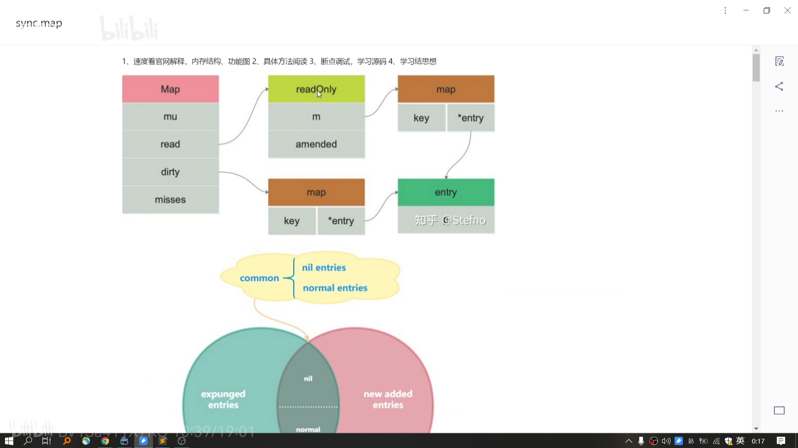

sync.Map 包括两个map ，read(read里读取，删除已经存在的key),dirty（增加数据）
    load() 如果 read里面没有，并且dity和read不同步(read.amended),则去dity里读
    store()如果 read里有则更新entry,如果read没有， 则去dirty里找，找到就更新entry，如果没有，看read.amended是否为false,如果是则说明一致，如果dity是nil，用read赋值dirty, 最后加入新key

    read给dirty赋值时，删除里的可以不会出现在dity里
    
    entry
        expunged 说明该key已经被删除，而且read和dirty数据不一致(dirty里面已经不存在expunged数据了)，dirty里面已经删除了(read->dirty转换的时候删除的),只有read里包含expunged数据
        nil      说明该key被删除，而且read和dirty里的数据一致，只需要修改p指针的值就行

为什么要引入expunged
    1. read->dirty转换的时候不清理nil key, 会导致map 越来越大
    2. read->dirty 转换的时候清理nil key, 导致read 里有，dirty里没有，
        2.1 如果再次更新的时候,直接更新read里的value,会导致dirty数据不全，下次dirty->read的时候就会丢失key, 因为不能删除read里的数据，如果要删除，read 也需要加锁了
        2.2 如果是read->dirty转换完之后删除key, 这时候都是nil key, 不需要考虑dirty里没有的情况

