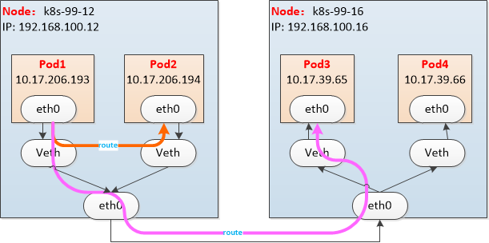
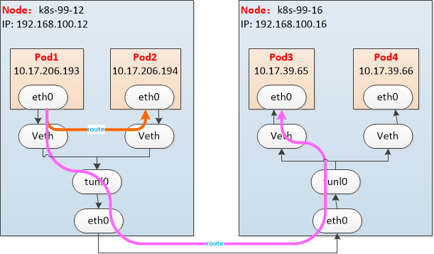

2. Calico
   2.1 Calico部署

部署前确保宿主机的iptables为legacy模式：
iptables --version
update-alternatives --set iptables /usr/sbin/iptables-legacy
update-alternatives --set ip6tables /usr/sbin/ip6tables-legacy
update-alternatives --set arptables /usr/sbin/arptables-legacy
update-alternatives --set ebtables /usr/sbin/ebtables-legacy

参考：https://docs.projectcalico.org/getting-started/kubernetes/self-managed-onprem/onpremises#install-calico-with-kubernetes-api-datastore-50-nodes-or-less
参考：https://blog.51cto.com/14143894/2463392

说明：

1. Calico可以自己读取集群的pod-cidr配置，无需像flannel一样去手动修改配置；

2. Calico网络模式的选择：
   enter description here
    BGP：CALICO_IPV4POOL_IPIP="Never" 且 CALICO_IPV4POOL_VXLAN=”Never“
    IP Tunnel: CALICO_IPV4POOL_IPIP="Always" 且 CALICO_IPV4POOL_VXLAN=”Never“
    VXLAN: CALICO_IPV4POOL_IPIP="Never" 且 CALICO_IPV4POOL_VXLAN=”Always“

3. 
    类似flannel的host-gw模式，但是有两点不同
   
   1. 不在使用bridge，所有pod通信全部走路由，例如pod1和pod2的通信的路由如下：
   2. 其他节点路由信息的添加由BGP负责，flannel则是通过自己的守护进程实现，可以看到calico-node的pod里跑了bird

4. 
   IP Tunnel方案相比BGP方案相比，唯一的区别时跨节点通信由原来的路由转发，改为IPIP隧道模式。好处时对节点网络没有二层互通的要求，只要节点三层可达，即可实现通信。

5. 
   在Calico也支持vxlan模式了，相比IP Tunnel模式，唯一的区别就是隧道类型变了，毕竟vxlan已经成为网络虚拟化的主流方案，和flannel一样都是使用的linux内核提供的vxlan功能。

BGP 模式

