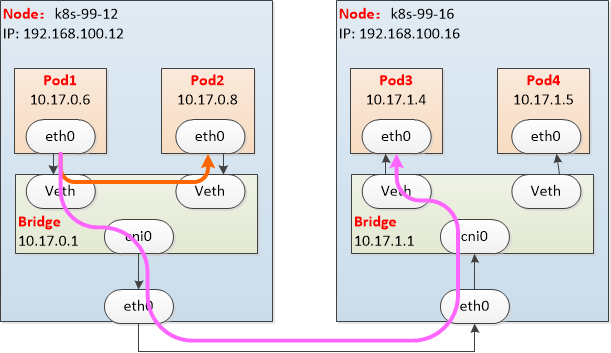
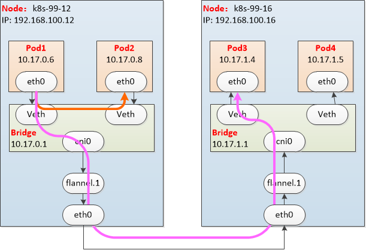

Flannel是CoreOS维护的一个网络组件，Flannel为每个Pod提供全局唯一的IP，Flannel使用ETCD来存储Pod子网与Node IP之间的关系。flanneld守护进程在每台主机上运行，并负责维护ETCD信息和路由数据包。

overlay Network
可部署完成，以在每个node上看到属于这个node子网

    root@k8s-99-12:~# cat /var/run/flannel/subnet.env
    FLANNEL_NETWORK=10.17.0.0/16
    FLANNEL_SUBNET=10.17.0.1/24
    FLANNEL_MTU=1450
    FLANNEL_IPMASQ=true

host-gw模式
     
        flannel的host-gw模式，就是将每个节点都当成一个网关，部署中指定pod-cidr后，flannel会为每个node分配一个子网，并将这些node子网信息都存储到etcd中
    ，然后每个节点上flannel守护进程会根据这些信息将其他所有节点都加到本地路由中以实现跨界点访问。
    限制：
       Node需要二层互通，否则下一条转发不出去（以我们的云主机为例，云主机之间转发靠流表，因此在云主机上搭建的k8s集群，如果采用flannel的host-gw模式，跨节点访问不通的）。

vxlan模式

#二层网络仅仅通过MAC寻址即可实现通讯，三层网络需要通过IP路由实现跨网段的通讯，可以跨多个冲突域

vxlan 

    vtep vxlan网络的边缘设备

    vni 是每个vxlan的唯一标识，共有2^24 个
