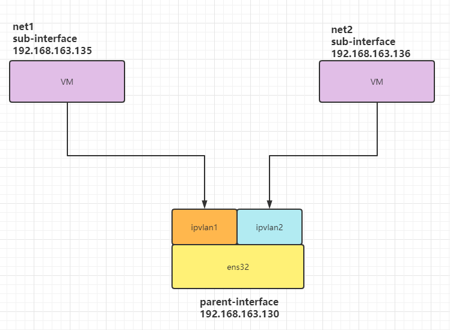
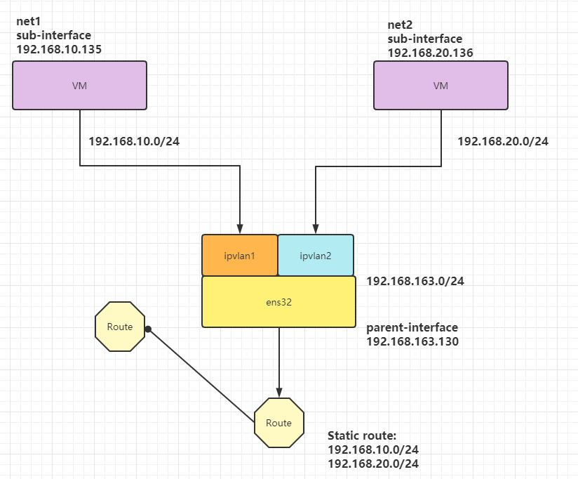
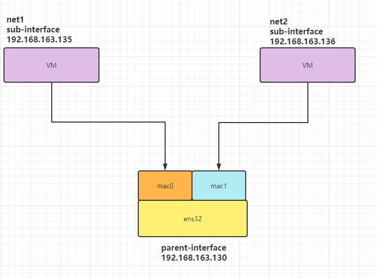

# 层次

集群配置，节点配置 以及 Pod 配置。与这三种情况对应的，其实是对集群网络 IP 段的三次划分：
首先 是集群 CIDR，接着为每个节点分配 podCIDR（即集群 CIDR 的子网段），最后在
podCIDR 里为每个 Pod 分配自己的 IP。

cni container network interface

1. flannel

2. calico

ipvlan_l2

ipvlan L2 模式和 macvlan bridge 模式工作原理很相似，父接口作为交换机来转发子接口的数据。同一个网络的子接口可以通过父接口来转发数据，而如果想发送到其他网络，报文则会通过父接口的路由转发出去。



ipvlan l3

ipvlan 有点像路由器的功能，它在各个虚拟网络和主机网络之间进行不同网络报文的路由转发工作。只要父接口相同，即使虚拟机/容器不在同一个网络，也可以互相 ping 通对方，因为 ipvlan 会在中间做报文的转发工作。



```perl
# 创建网络空间
ip netns add net1
ip netns add net2
# 创建子接口
ip link add ipvlan1 link ens32 type ipvlan mode l3
ip link add ipvlan2 link ens32 type ipvlan mode l3
# 关联ipvlan l3与vm上的网络空间
ip link set ipvlan1 netns net1
ip link set ipvlan2 netns net2
# 设置不同网段
ip netns exec net1 ifconfig ipvlan1 192.168.10.135/24 up
ip netns exec net2 ifconfig ipvlan2 192.168.20.136/24 up
# 测试一下二则是否ping得通
ip netns exec net1 ping 192.168.20.136
```

maxvlan

Macvlan 允许你在主机的一个网络接口上配置多个虚拟的网络接口，这些网络 `interface` 有自己独立的 MAC 地址，也可以配置上 IP 地址进行通信。Macvlan 下的虚拟机或者容器网络和主机在同一个网段中，共享同一个广播域。Macvlan 和 `Bridge` 比较相似，但因为它省去了 Bridge 的存在，所以配置和调试起来比较简单，而且效率也相对高。除此之外，Macvlan 自身也完美支持 `VLAN`。



```perl

```
