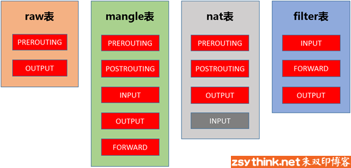

到本机某进程的报文：PREROUTING –> INPUT
由本机转发的报文：PREROUTING –> FORWARD –> POSTROUTING
由本机的某进程发出报文（通常为响应报文）：OUTPUT –> POSTROUTING

#表的概念
我们把具有相同功能的规则的集合叫做”表”，所以说，不同功能的规则，我们可以放置在不同的表中进行管理，而iptables已经为我们定义了4种表，每种表对应了不同的功能

1. filter表：负责过滤功能，防火墙；内核模块：iptables_filter
2. nat表：network address translation，网络地址转换功能；内核模块：iptable_nat
3. mangle表：拆解报文，做出修改，并重新封装 的功能；iptable_mangle
4. raw表：关闭nat表上启用的连接追踪机制；iptable_raw

##优先级次序（由高而低）：
    raw –> mangle –> nat –> filter

#table表可以操作的chain
raw     表中的规则可以被哪些链使用：PREROUTING，OUTPUT
mangle  表中的规则可以被哪些链使用：PREROUTING，INPUT，FORWARD，OUTPUT，POSTROUTING
nat     表中的规则可以被哪些链使用：PREROUTING，OUTPUT，POSTROUTING（centos7中还有INPUT，centos6中没有）
filter  表中的规则可以被哪些链使用：INPUT，FORWARD，OUTPUT
可以使用iptables -t raw -L ,-L命令会列出该表支持的过滤阶段 -vL 更详细的信息

#动作
1. ACCEPT：允许数据包通过。
2. DROP：直接丢弃数据包，不给任何回应信息，这时候客户端会感觉自己的请求泥牛入海了，过了超时时间才会有反应。
3. REJECT：拒绝数据包通过，必要时会给数据发送端一个响应的信息，客户端刚请求就会收到拒绝的信息。
4. SNAT：源地址转换，解决内网用户用同一个公网地址上网的问题。
5. MASQUERADE：是SNAT的一种特殊形式，适用于动态的、临时会变的ip上。
6. DNAT：目标地址转换。
7. REDIRECT：在本机做端口映射。
8. LOG：在/var/log/messages文件中记录日志信息，然后将数据包传递给下一条规则，也就是说除了记录以外不对数据包做任何其他操作，仍然让下一条规则去匹配。

-n选项，表示不对IP地址进行名称反解，直接显示IP地址
–line-numbers即可显示规则的编号
iptables -F INPUT命令清空filter表INPUT链中的规则
-I --insert INPUT表示将规则插入于INPUT链中，即添加规则之意
-A为append之意，所以，-A INPUT则表示在INPUT链中追加规则，而之前示例中使用的-I选项则表示在链中”插入规则”，聪明如你一定明白了，它们的本意都是添加一条规则，只是-A表示在链的尾部追加规则，-I表示在链的首部插入规则而已。
-D选项表示删除指定链中的某条规则 
service iptables save 保存1
-i选项用于匹配报文从哪个网卡流入，只能用于PREROUTING链、INPUT链、FORWARD链
-o选项用于匹配报文将从哪个网卡流出,只能用于FORWARD链、OUTPUT链、POSTROUTING链

扩展
-m tcp,udc,,
–dport可以匹配报文的目标端口，–dport意为destination-port，即表示目标端口,使用–dport选项时，必须事先指定了使用哪种协议，即必须先使用-p选项
-sport 匹配源端口

-m multiport
--destination-ports,--dports 匹配多个目标端口
--source-ports,--sports 匹配多个源端口
--ports 匹配端口
-m tcp表示使用tcp扩展模块,

param
    -p, --protocol
    -s, --source
    -d, --destination

