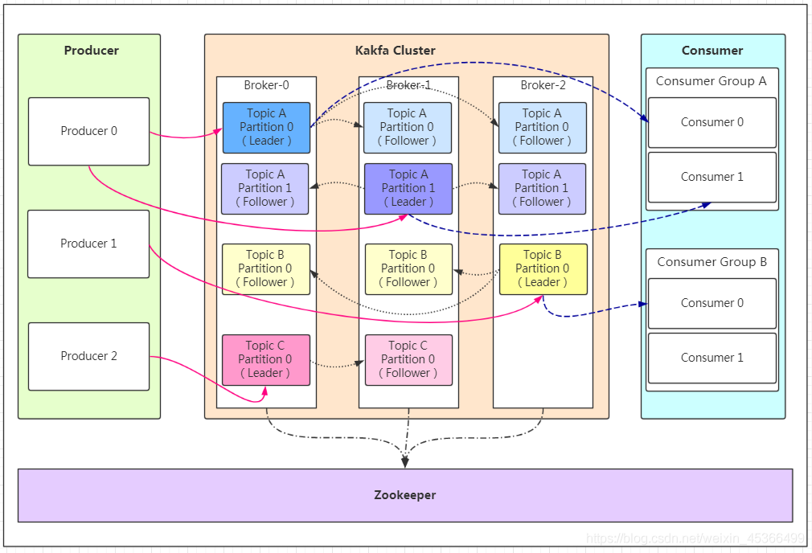
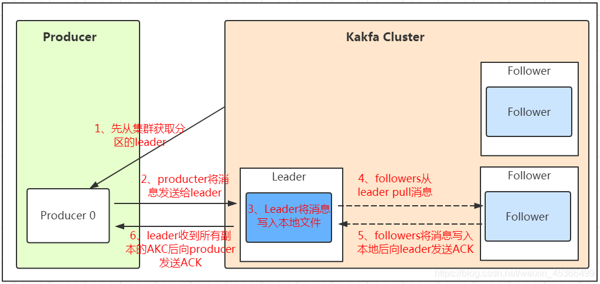
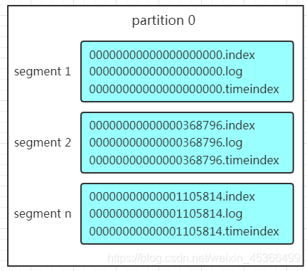
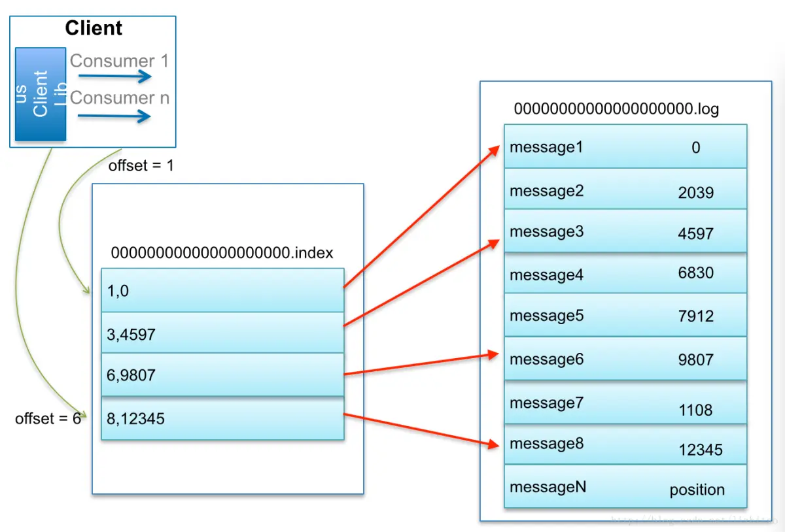

环境
  1 安装java  
      sudo apt install default-jdk
  2 下载kafka
      http://kafka.apache.org/quickstart

kafka 注意事项
   1 一个topic可以在一个broker有多个partion
   2 replication-factor 不能大于 broker-num

at most onece模式
基本思想是保证每一条消息commit成功之后，再进行消费处理；
设置自动提交为false，接收到消息之后，首先commit，然后再进行消费

at least onece模式
基本思想是保证每一条消息处理成功之后，再进行commit；
设置自动提交为false；消息处理成功之后，手动进行commit；
采用这种模式时，最好保证消费操作的“幂等性”，防止重复消费；

exactly onece模式
核心思想是将offset作为唯一id与消息同时处理，并且保证处理的原子性；
设置自动提交为false；消息处理成功之后再提交；
比如对于关系型数据库来说，可以将id设置为消息处理结果的唯一索引，再次处理时，如果发现该索引已经存在，那么就不处理；

kafka 消息事件流
缓存/消峰 ，
解耦- 允许你独立的扩展或修改两边的处理过程，只要确保两边遵守相同的接口约束
异步通信 

partitions 分区数 ，只能增加，不能减少
replications-factors 副本数，只能增加，不能减少

至少一次（At Least Once）= ACK级别设置为-1 + 分区副本大于等于2 + ISR里应答的最小副本数量大于等于2
最多一次（At Most Once）= ACK级别设置为0

At Least Once可以保证数据不丢失，但是不能保证数据不重复；
At Most Once可以保证数据不重复，但是不能保证数据不丢失。

broker
    min.insync.replicas 只有acks设置成all的时候才会使用，

producter
    batch.size: 只有数据积累到batch.size之后，sender才会发送数据。默认16k
    linger.ms：如果数据迟迟未达到batch.size，sender等待linger.ms设置的时间到了之后就会发送数据。单位ms，默认值是0ms，表示没有延迟。
    acks:    0：生产者发送过来的数据，不需要等数据落盘应答。 
            • 1：生产者发送过来的数据，Leader收到数据后应答。
            • -1（all）：生产者发送过来的数据，Leader和ISR队列里面的所有节点收齐数据后应答。-1和all等价。
    max.in.flight.requests.per.connection 允许最多没有返回 ack 的次数，默认为 5，开启幂等性要保证该值是 1-5 的数字。
    retries: 当消息发送出现错误的时候，系统会重发消息。retries表示重试次数。默认是 int 最大值，2147483647。
            如果设置了重试，还想保证消息的有序性，需要设置MAX_IN_FLIGHT_REQUESTS_PER_CONNECTION=1
            否则在重试此失败消息的时候，其他的消息可能发送成功了。

    retry.backoff.ms 两次重试之间的时间间隔，默认是 100ms。
    idempotent 幂等性
        精确一次（Exactly Once） = 幂等性 + 至少一次（ ack=-1 + 分区副本数>=2 + ISR最小副本数量>=2） 。
        重复数据的判断标准：具有<PID, Partition, SeqNumber>相同主键的消息提交时，Broker只会持久化一条。其 中PID是Kafka每次重启都会分配一个新的；Partition 表示分区号；Sequence Number是单调自增的。
    
    MaxOpenRequests 
    
    go:
            producer, err := sarama.NewAsyncProducer(bks, config)
            producer, err := sarama.NewSyncProducer(bks, config)

Leader维护了一个动态的in-sync replica set（ISR），意为和Leader保持同步的Follower+Leader集合(leader：0，isr:0,1,2)。

consumer
    --from-begining 从最开始的offset 开始拉取 old/new

    pull 模式
    自动提交offset,手动提交(sync/async)
    
    offset保存在topic里面

isr 活着的broker
ar  所有的节点
LEO（Log End Offset）：每个副本的最后一个offset，LEO其实就是最新的offset + 1。
HW（High Watermark）：所有副本中最小的LEO 。

##### Partition 结构

    每个partition的文件夹下面会有多组segment文件，每组segment文件又包含.index文件、.log文件、.timeindex文件（早期版本中没有）三个文件， log文件就实际是存储message的地方，而index和timeindex文件为索引文件，用于检索消息。

如上图，这个partition有三组segment文件，每个log文件的大小是一样的，但是存储的message数量是不一定相等的（每条的message大小不一致）。文件的命名是以该segment最小offset来命名的，如000.index存储offset为0~368795的消息，kafka就是利用分段+索引的方式来解决查找效率的问题。

offset定位

1. 首先是用二分查找确定它是在哪个LogSegment中，自然是在第一个Segment中。

2. 打开这个Segment的index文件，也是用二分查找找到offset小于或者等于指定offset的索引条目中最大的那个offset。自然offset为6的那个索引是我们要找的，通过索引文件我们知道offset为6的Message在数据文件中的位置为9807。

3. 打开数据文件，从位置为9807的那个地方开始顺序扫描直到找到offset为7的那条Message。

