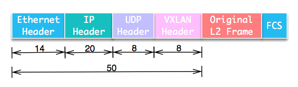
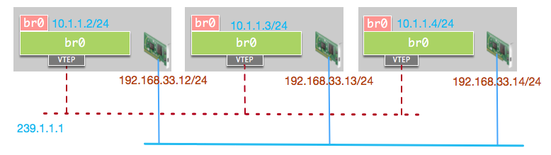
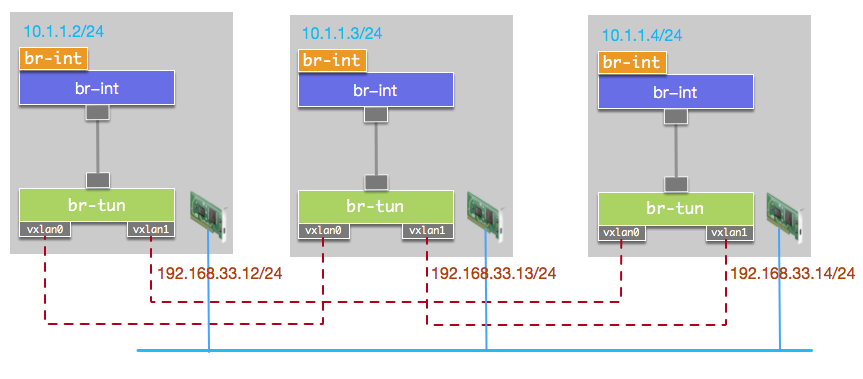

VXLAN将二层数据帧封装在UDP数据包中，构建隧道在不同节点间通信。包结构如图:

Linux环境中常用的VXLAN实现有两种:
    Linux内核实现
    OpenvSwitch实现

    OVS不支持组播，需要为任意两个主机之间建立VXLAN单播隧道。

对于大规模的VXLAN网络中，最核心的问题一般有两个:
    如何发现网络中其他VTEP
    如何降低BUM（Broadcast, Unknown unicast, Multicast)流量

在对于问题一来说，之前的文章中的解决方法是洪泛，对于问题二，则通过源地址学习来确定MAC地址的归属。VXLAN的转发过程主要依赖FDB(Forwarding Database)实现。
二层网桥的FDB表项格式可表达为:
    <MAC> <VLAN> <DEV PORT>
VXLAN设备的表项与之类似，可以表达为:
    <MAC> <VNI> <REMOTE IP>

vxlan

node1

1. ip link add vxlan20 type vxlan id 20 remote 192.168.136.12 dstport 4789 dev eth0

2. ip -d link show vxlan20

3. ip link set vxlan20 up

4. ip addr add 10.0.136.11/16 dev vxlan20

node2

1. ip link add vxlan20 type vxlan id 20 remote 192.168.136.11 dstport 4789 dev eth0

2. ip -d link show vxlan20

3. ip link set vxlan20 up

4. ip addr add 10.0.136.12/16 dev vxlan20
