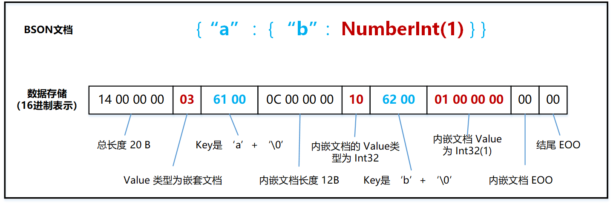

BSON 存储格式

一条最简单的 BSON 文档，从前向后可以拆解成以下几个部分：
    文档的总长度， 占 4 个字节；
    Value 类型，参考代码定义，占 1 个字节；
    Key 的 String 表示形式（Key 只能 String 类型），长度不固定，以 '\0' 结尾，占 len(Key)+1 个字节；
    Value 的二进制存储，比如 Int32 占 4 字节，Long 和 Double 占 8 个字节等，文章后续会对常用类型逐一举例分析；
    文档以 '\0' 结尾，也就是在遍历 BSON 到末尾时，常见的 EOO(End Of Object)，占 1 个字节；

下面列举常用的 Int32, Double, String, 内嵌文档，Array 类型，并分析它们的 16 进制表现形式。

**嵌套文档**

嵌套文档和普通文档一样，头部也包含了额外的 4 字节长度空间。比如下面的例子 {"b" : NumberInt(1)} 的存储长度为 12 字节。

**数组类型**

数组类型头部有 4 个字节存储长度，每个元素都对应有下标，从 '0' 开始递增。

比如下面的例子中，"a.0" 表示第 1 个元素，值为 Double(1)， "a.3" 表示第 4 个元素，值为 "4".
