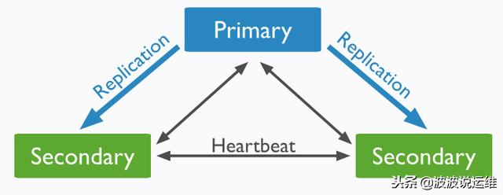
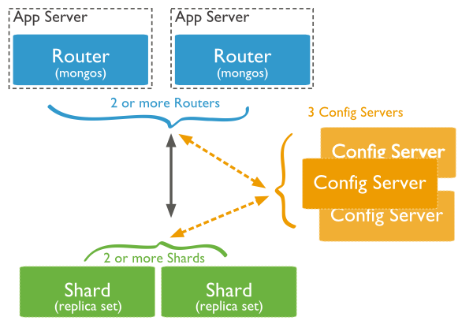
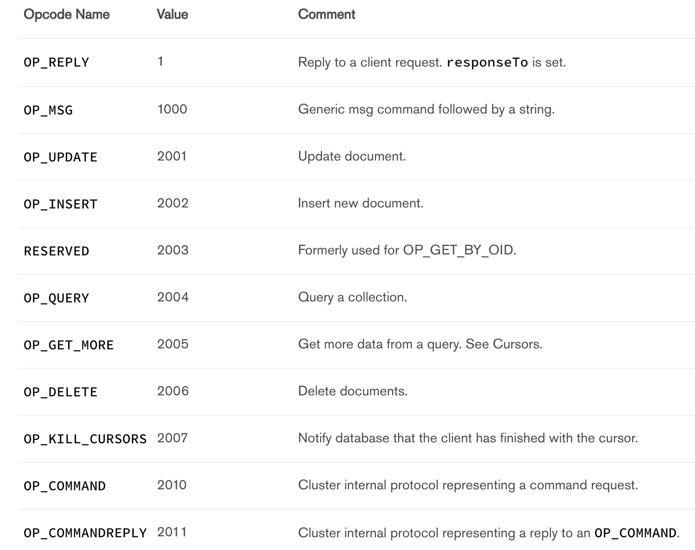

MongoDB 可调一致性模型功能接口 —— writeConcern 和 readConcern
writeConcern —— 唯一关心的就是写入数据的持久性（Durability）
    { w: <value>, j: <boolean>, wtimeout: <number> }
        w，指定了这次的写操作需要复制并应用到多少个副本集成员才能返回成功，可以为数字或 “majority”（为了避免引入过多的复杂性，这里忽略基于 tag 的自定义 writeConcern）。
           w:0 时比较特殊，即客户端不需要收到任何有关写操作是否执行成功的确认，具有最高性能。w: majority 需要收到多数派节点（含 Primary）关于操作执行成功的确认，具体个数由 MongoDB 根据副本集配置自动得出。
        j，额外要求节点回复确认时，写操作对应的修改已经被持久化到存储引擎日志中。
        wtimeout，Primary 节点在等待足够数量的确认时的超时时间，超时返回错误，但并不代表写操作已经执行失败。
    这里还要提及两个概念，「local committed」 和 「majority committed」，对应到 writeConcern 分别为 w:1 和 w: majority

readConcern —— 关心读取数据的新近度（Recency）和持久性（Durability）
    在 MongoDB 4.2 中包含 5 种 readConcern 级别，我们先来看前 4 种：「local」, 「available」, 「majority」, 「linearizable」，
        local/available：local 和 available 的语义基本一致，都是读操作直接读取本地最新的数据。但是，available 使用在 MongoDB 分片集群场景下，含特殊语义（为了保证性能，可以返回孤儿文档），这个特殊语义和本文的主题关联不大，所以后面我们只讨论 local readConcern。在这个级别下，发生重新选主时，已经读到的数据可能会被回滚掉。
        majority：读取「majority committed」的数据，可以保证读取的数据不会被回滚，但是并不能保证读到本地最新的数据。比如，对于上图中的 Primary 节点读，虽然 x=5 已经是最新的已提交值，但是由于不是「majority committed」，所以当读操作使用 majority readConcern 时，只返回x=4。
        linearizable：承诺线性一致性，即，既保证能读取到最新的数据（Recency Guarantee），也保证读到数据不会被回滚（Durability Guarantee）。前面我们说了，线性一致性在真实系统中很难实现，MongoDB 在这里采用了一个相当简化的设计，当读操作指定 linearizable readConcern level 时，读操作只能读取 Primary 节点，而考虑到写操作也只能发生在 Primary，相当于 MongoDB 的线性一致性承诺被限定在了单机环境下，而非分布式环境，实现上自然就简单很多。考虑到会有重新选主的情况，MongoDB 在这个 readConcern level 下唯一需要解决的问题就是，确保每次读发生在真正的 Primary 节点上。后面分析具体实现我们可以看到，解决这个问题是以增加读延迟为代价的。

架构模式

    Replica set：复制集，mongodb的架构方式之一 ，通常是三个对等的节点构成一个“复制集”集群，有“primary”和secondary等多中角色（稍后详细介绍），其中primary负责读写请求，secondary可以负责读请求，这有配置决定，其中secondary紧跟primary并应用write操作；如果primay失效，则集群进行“多数派”选举，选举出新的primary，即failover机制，即HA架构。复制集解决了单点故障问题，也是mongodb垂直扩展的最小部署单位，当然sharding cluster中每个shard节点也可以使用Replica set提高数据可用性

    Sharding cluster：分片集群，数据水平扩展的手段之一；replica set这种架构的缺点就是“集群数据容量”受限于单个节点的磁盘大小，如果数据量不断增加，对它进行扩容将时非常苦难的事情，所以我们需要采用Sharding模式来解决这个问题。将整个collection的数据将根据sharding key被sharding到多个mongod节点上，即每个节点持有collection的一部分数据，这个集群持有全部数据，原则上sharding可以支撑数TB的数据。

protocol
    struct MsgHeader {

        int32   messageLength; // 消息的总长度(byte)，包括该消息头的长度
    
        //当客户端向mongodb服务器发送请求时会生成一个requestID，
        //作为此次请求的唯一标识。当mongodb服务器向客户端返回信息，
        //回设置responseTo，responseTo的值就是之前客户端发过来的requestID
        int32   requestID;     
        int32   responseTo;    
    
        int32   opCode; //表示请求的类型，有 QUERY,INSERT,UPDATE ...等等
    }
    
